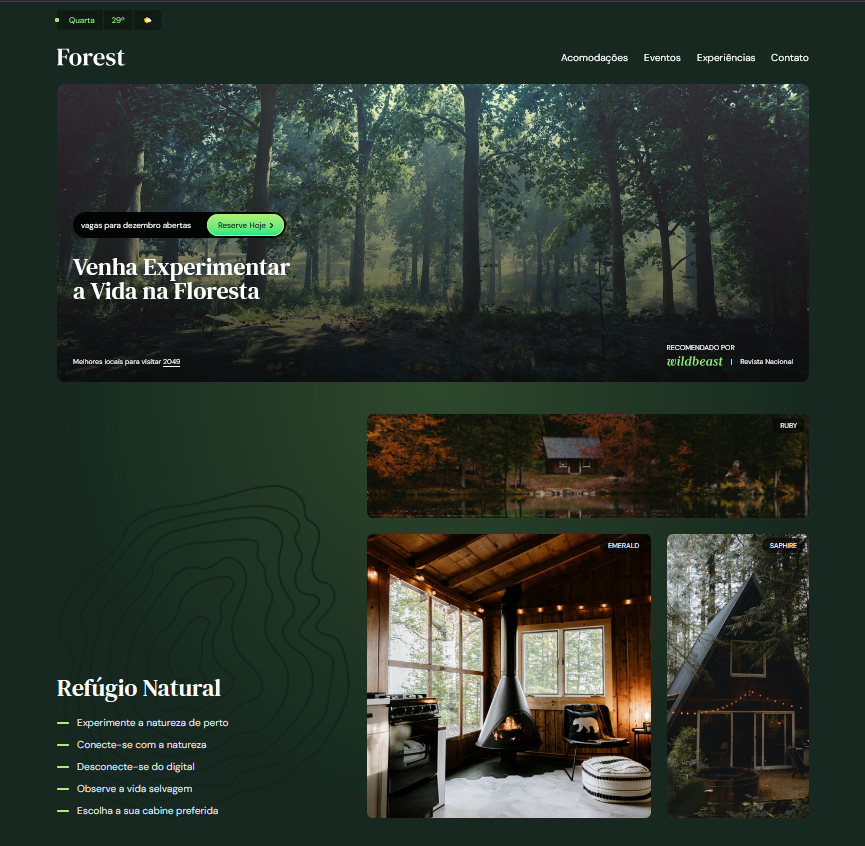

# 🌲 Forest – Landing Page com Tailwind CSS

Projeto de landing page responsiva desenvolvida com **HTML5**, **JavaScript** e **Tailwind CSS**, com foco em uma experiência imersiva na natureza.  
Inclui **vídeos de fundo**, **animações**, **design responsivo** e **componentes reutilizáveis** do Tailwind.

## Preview


---

## Hospedagem do projeto
```bash
https://project-forest-tailwind.netlify.app/
```


## ✨ Funcionalidades

- 🌤️ **Widget de clima dinâmico** (dia da semana, temperatura e condição do tempo aleatória)  
- 🎥 **Vídeo de fundo** que muda conforme a condição climática  
- 📱 **Menu responsivo** com botão hamburguer em dispositivos móveis  
- 🏡 Sessões:
  - Acomodações (cabines temáticas Ruby, Emerald e Saphire)
  - Eventos (datas especiais como Lua Nova, Aurora Boreal, Chuva de Meteoros)
  - Experiências (canoagem, observação noturna, vida selvagem)
  - Ciclo natural (amanhecer, meio-dia, anoitecer)
  - Contato com formulário estilizado
  - Parceiros e rodapé com redes sociais

---

## 🛠️ Tecnologias utilizadas
<div>
  
  
  
  
</div>

## 📂 Estrutura do Projeto

## 1 - Clone o repositório:
```bash
git clone https://github.com/idaniloborges/project-forest-tailwind.git
```
```bash
cd project-forest-tailwind
```

## 2 - Instale as dependências (é preciso ter Node.js
```bash
npm install
```

## 3 - Rode o Tailwind para compilar os estilos:
```bash
npx tailwindcss -i ./src/input.css -o ./output.css --watch
```
## 4 - Abra o arquivo index.html no navegador.


## 📌 Melhorias futuras

- [x] Deploy

- [ ] Integração real com API de clima (ex: OpenWeather)

- [ ] Backend para processar formulários de contato


